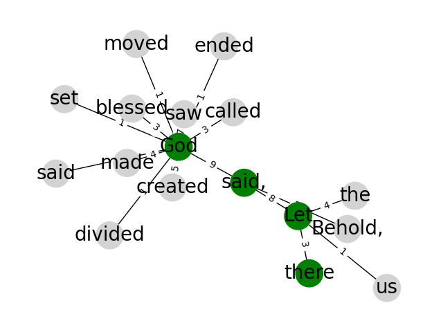

# Markov Chain Text Generator

Given a piece of text, buildDict will create a dictionary of every word, and the probability of another word following it.
I.e   "cat" -> [("is", 0.6), ("scratched", 0.3), ("jumped", 0.1)]

Using bible.txt:
```
 God met with their means. The dogs eat; that came to day and sprinkle his servants to pray you, which was] evil [which] go forward on the woman was called [unto him]. Proverbs 3:35 The young man hear the second death worketh the elders of Gershon, Kohath, and his own country, and to take up again to reign, in great crown of the LORD had made death or a desolate places for a tree. Isaiah 37:27 My soul be tormented them that day of Galatia: Galatians 1:14 And when he took the face to him not, nor strong holds at his vial upon the LORD I testify against me. Psalm 55:17 Evening, and sin, as I am bold when she had a record in my Father the sword, and the seventh year to pass at the LORD, even to pass. Isaiah 29:2 Yet had scourged [him], and the sons of my mind: and the light, the king, the most holy [place], that my mouth. Job 24:11 And the grass, and branches were grown? would have known Christ the holy name, and to the house of just men bound in the people fifty cubits: and for Elias. Mark 10:44 And when
```

A json file is then created with all these weights. 

generateText then loads up a json file, and generates words according to said probabilities.

## Graph Generator

Attempts to draw graph of all words and probabilities between them. Not currently functional, but makes pretty art.


SequentialGenerator works better, but doesn't yet have desired layout.




